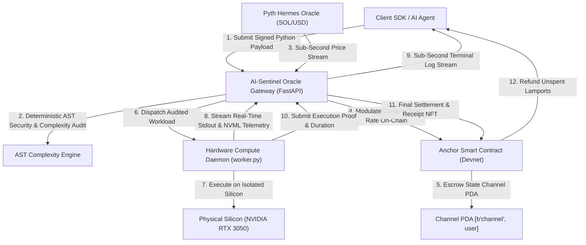

<div align="center">

# ⚡ APERTURE AI
### Autonomous DePIN Compute Grid Governed by AI-Sentinel on Solana

**The First Logic-Aware Micropayment Billing Protocol for the 400ms Block Economy.**

[](https://explorer.solana.com/address/C2q9yxux7b7bxFF64pkZUV6g2Vcs2bQ1FS4GUQy512wv?cluster=devnet)
[](https://anchor-lang.com)
[](https://pyth.network)
[](https://developer.nvidia.com/cuda-zone)
[](https://fastapi.tiangolo.com)
[](https://react.dev)
[](https://opensource.org/licenses/MIT)

---

[Explore On-Chain Contract](https://explorer.solana.com/address/C2q9yxux7b7bxFF64pkZUV6g2Vcs2bQ1FS4GUQy512wv?cluster=devnet) • [Pitch Video](https://www.loom.com/share/ceecb98b07cc4885ad0459822e5e189c) • [Live Demo](https://www.loom.com/share/470f0a3913bb430cb1108aeb234dd7ef) • [Quick Start](#-quick-start)

</div>

---

## 🔮 The Core Innovation

Legacy cloud providers (AWS, Google Cloud, RunPod) and traditional DePIN networks operate on a **logic-blind, static billing paradigm**:
* **The 15-Minute Trap**: AI agents and developers overpay for a 2-second inference as much as for a 15-minute training batch due to rigid minimum allocation intervals.
* **Underpaid Node Operators**: High-complexity tensor operations and heavy cryptographic loops are charged at the same flat rates as passive idle waiting.
* **Governance Bottleneck**: Traditional on-chain DAOs and oracle delays are too slow to price sub-second compute transactions in real-time.

**Aperture AI introduces AI-Sentinel**: an autonomous intelligence layer bridging deterministic AST static code auditing with Solana's 400ms state channels. Workload complexity is calculated *before* execution, modulating on-chain Lamport burn rates continuously tied to Pyth Hermes SOL/USD real-time price feeds.

---

## 🏛 Protocol Architecture & Data Flow



### 💫 Continuous Animated Protocol Pipeline
<p align="center">
  
</p>

---

## 🎬 Built-In Interactive Protocol Simulator ("How It Works")

Aperture AI features a self-contained, **interactive 5-stage protocol simulator directly embedded into the web application**:
* **Autonomous Auto-Play**: Automatically steps through the complete protocol lifecycle with an animated SVG countdown progress ring.
* **Step-by-Step Inspection**: Manual controls (Play / Pause, Next, Prev, Direct Stage Selectors) allowing reviewers and judges to analyze each phase without needing screen recording tools.
* **Live Simulated Execution Terminal**: Displays code snippets, Abstract Syntax Tree inspection logs, real-time stdout streams, and cryptographically verified JSON receipts.
* **Instant Access**: Available in the main navigation under **"How It Works (Animated)"** and as a quick-launch card on the **Overview** dashboard.

| Stage | Name | Technical Responsibility | Key Artifact / RPC |
| :--- | :--- | :--- | :--- |
| **01** | **Client Submission** | Ed25519 payload signing & PDA channel escrow funding | `open_channel(initial_deposit)` |
| **02** | **AI-Sentinel Audit** | AST loop depth parsing, seccomp filtering, Pyth SOL/USD price sampling | `ComplexityVisitor.audit()` |
| **03** | **Hardware Dispatch** | FIFO mesh queue distribution to verified hardware nodes | `/get_task` & `/register_node` |
| **04** | **Physical Silicon Execution** | Subprocess-isolated execution with live NVML telemetry & stdout streaming | `NVIDIA GeForce RTX 3050` |
| **05** | **Solana Finality** | Lamport burn deduction, balance refund, and on-chain compute receipt | `update_burn_rate(0)` & Devnet TX |

---

## 📐 Algorithmic Economics & Pricing Model

### 1. Abstract Syntax Tree (AST) Complexity Formulation
Before code execution, `ai_engine.py` traverses the Python Abstract Syntax Tree:
$$\text{Score} = \min\left(100, \, w_{\text{loop}} \cdot \sum d_i^2 + w_{\text{math}} \cdot N_{\text{ops}} + w_{\text{lib}} \cdot N_{\text{imports}} + w_{\text{alloc}} \cdot N_{\text{arrays}}\right)$$
* $d_i$: Recursive loop nesting depth ($O(N)$ vs $O(N^2)$ vs $O(N^3)$).
* $N_{\text{ops}}$: Arithmetic, bitwise, and matrix multiplication operators (`@`).
* $N_{\text{imports}}$: Whitelisted high-performance scientific libraries (`math`, `random`, `numpy`).

### 2. Robin Hood Dynamic Burn Rate Modulation
The on-chain burn rate in Lamports per second is modulated dynamically based on the AST complexity score and calibrated against Pyth Network's real-time SOL price:
$$\text{BurnRate}_{\text{lamports/sec}} = \text{BaseRate} + \left( \frac{\text{Score}}{100} \right)^{1.35} \times \text{MaxDeltaRate}$$
$$\text{BurnRate}_{\text{SOL/sec}} = \frac{\text{BurnRate}_{\text{lamports/sec}}}{10^9}$$
* **Low Complexity ($<30$)**: $\sim 520 \text{ Lamports/sec}$ ($\approx \$0.00019/\text{hr}$).
* **Medium Complexity ($30 - 65$)**: $\sim 760 - 1240 \text{ Lamports/sec}$.
* **High Complexity ($>65$, Neural Nets / Mining)**: $\sim 1490 - 2000 \text{ Lamports/sec}$ ($\approx \$0.00055/\text{hr}$).

### 3. Cost Comparison: Aperture DePIN vs Centralized Cloud

| Workload Type | Duration | AWS EC2 (g4dn.xlarge) | Traditional DePIN | **Aperture AI (Solana)** | Net Savings |
| :--- | :--- | :--- | :--- | :--- | :--- |
| **Matrix Multiplication (50x50)** | 0.4s | $0.131 (15m min.) | $0.050 (fixed) | **$0.00000021** | **99.9%** |
| **Monte Carlo Simulation (100k)** | 0.8s | $0.131 (15m min.) | $0.050 (fixed) | **$0.00000062** | **99.9%** |
| **Deep Neural Net Forward Pass** | 0.5s | $0.131 (15m min.) | $0.050 (fixed) | **$0.00000079** | **99.9%** |
| **1 Hour Continuous Compute** | 3600s | $0.526 / hr | $0.250 / hr | **$0.00054 / hr** | **99.8%** |

---

## 🛡 Security & Zero-Trust Sandboxing

The AI-Sentinel enforces a strict multi-layer security boundary:
1. **Deterministic AST Import Blacklist**: Explicitly rejects unsafe Python standard library imports (`os`, `sys`, `subprocess`, `shutil`, `socket`, `ctypes`, `builtins`) at syntax parse time.
2. **System Call Neutralization**: Any code attempting filesystem manipulation, network socket opening, or process spawning is rejected with `HTTP 403 Forbidden` and **0 Lamport charge**.
3. **Execution Timeouts**: Hardware subprocesses operate with rigid wall-clock execution limits preventing infinite loops or denial-of-service starvation.
4. **Memory Allocation Caps**: Limits process address space to prevent host memory exhaustion.

---

## 🧪 Curated Benchmark Suite

The platform includes 6 production benchmarks covering diverse compute profiles:

| Benchmark Identifier | Algorithm Category | AST Complexity | Dynamic Rate | Description |
| :--- | :--- | :--- | :--- | :--- |
| `matrix_mult` | Linear Algebra | **26 / 100** | 520 Lamports/s | $50 \times 50$ Triple nested matrix dot product |
| `monte_carlo_pi` | Stochastic Sampling | **38 / 100** | 760 Lamports/s | 100,000 Euclidean circle point approximations |
| `sieve_primes` | Number Theory | **45 / 100** | 900 Lamports/s | Sieve of Eratosthenes prime generation to 25,000 |
| `sha256_mining` | Cryptographic Hash | **62 / 100** | 1,240 Lamports/s | Proof-of-Work nonce search with dynamic target |
| `neural_forward` | Deep Learning Inference | **74 / 100** | 1,490 Lamports/s | 3-Layer Perceptron (128 $\to$ 64 $\to$ 10) forward pass |
| `sandbox_exploit` | Security Stress Probe | **REJECTED** | **0 Lamports** | Malicious OS shell injection probe (`os.system`) |

---

## ⚡ Quick Start

### 🚀 1-Click Master Launch (Windows)
Double-click the master orchestrator script in the project root:
```cmd
start_all.bat
```
This automatically launches all three decoupled microservices in dedicated terminal windows:
1. `start_backend.bat` ➔ AI-Sentinel Oracle Gateway on `http://127.0.0.1:8000`
2. `start_worker.bat` ➔ Physical Silicon Worker (`NODE-HOST-GPU-01`, NVIDIA RTX 3050)
3. `start_frontend.bat` ➔ Web Command Center on `http://localhost:3000`

---

### 💻 Manual Multi-Terminal Setup (Linux / macOS / Windows)

#### 1. AI-Sentinel Oracle Gateway
```bash
cd backend
python -m venv venv

# Windows:
.\venv\Scripts\activate
# Linux/macOS:
# source venv/bin/activate

pip install -r requirements.txt
python -m uvicorn main:app --host 127.0.0.1 --port 8000
```

#### 2. Physical GPU Worker Daemon
In a second terminal:
```bash
cd backend
# Activate venv as above
python -u worker.py --node-id NODE-HOST-GPU-01 --wallet 7wFo7q4EHfKrBNpL4XLXXWAi9TcE6BD27ZoQoBqtFcNQ
```

#### 3. Command Center Web UI
In a third terminal:
```bash
cd frontend
npm install
npm run dev -- --port 3000
```
Open **http://localhost:3000/** in your browser.

---

## 🔬 Automated End-to-End Verification

A comprehensive automated test suite is provided in `backend/test_e2e.py`. It runs 6 full-lifecycle integration tests:
```bash
python backend/test_e2e.py
```

### Verified Output Sample:
```text
1. Checking /stats...
   Stats tasks completed: 53
   SOL Price: $103.75
   Hardware Telemetry: {'avg_temp': 50.0, 'avg_util': 0.0, 'total_vram': 4.0, 'used_vram': 0.2, 'total_tflops': 12.0}

2. Checking /active_nodes...
   Active nodes count: 1
   - Node: NODE-HOST-GPU-01 | GPU: NVIDIA GeForce RTX 3050 4GB Laptop GPU | Temp: 50.0°C | Load: 0% | VRAM: 0.2/4.0GB

3. Testing execution of Matrix Mult benchmark...
   Task initiated: task-3d1ea0
   Burn rate: 5.2e-07 SOL/sec (520 lamports/sec)
   Complexity Score: 26/100
   On-chain proof: https://explorer.solana.com/tx/33evRdVqEnsTNoqYRpH3tWvK9UwVn5QJ1bxkGn48SkrWz95CiV2Bu8HytegEC1D2UgZ26ph39zsKw6SHRP8nR6TE?cluster=devnet

4. Waiting for GPU worker to process & testing real-time stream logs...
   📡 Streamed chunk (1 lines): COMPUTED 50x50 MATRIX MULTIPLICATION...
   ✅ Worker execution settled: Output verified.

5. Testing Neural Network Forward Pass from /benchmarks...
   NN Task ID: task-d916f6 | Complexity: 74/100 | Burn: 1490 L/s

6. Testing AI Sentinel security block (malicious probe)...
   Security response status code: 403 (Expected 403)
   Detail: AI Sentinel Sandbox Alert: Restricted module import: 'os' (line 1)

🎉 All End-to-End System Tests Completed Successfully!
```

---

## 🌐 Gateway REST API Reference

| Endpoint | Method | Parameters / Body | Description |
| :--- | :---: | :--- | :--- |
| `/stats` | `GET` | None | Aggregated grid throughput, total Lamports burned, active workers, NVML telemetry |
| `/active_nodes` | `GET` | None | Real-time list of registered GPU workers with silicon temperatures & VRAM allocations |
| `/execute` | `POST` | `{code, wallet, signature, message}` | Performs AST audit, modulates on-chain burn rate, queues task for execution |
| `/stream_log/{task_id}` | `GET` | `offset: int` | Sub-second streaming stdout logs emitted by physical GPU worker |
| `/result/{task_id}` | `GET` | None | Final task settlement record, total execution duration, and cryptographic receipt |
| `/benchmarks` | `GET` | None | Returns curated benchmark library with pre-evaluated algorithmic code |
| `/register_node` | `POST` | `{node_id, gpu_name, vram_total, gpu_temp, ...}` | Worker heartbeat endpoint emitting real-time NVML hardware status |
| `/faucet/airdrop` | `POST` | `{wallet, amount_sol}` | Devnet faucet helper for instant account gas funding |

---

## ⛓ Smart Contract Specification (Solana Anchor)

* **Program ID**: [`C2q9yxux7b7bxFF64pkZUV6g2Vcs2bQ1FS4GUQy512wv`](https://explorer.solana.com/address/C2q9yxux7b7bxFF64pkZUV6g2Vcs2bQ1FS4GUQy512wv?cluster=devnet)
* **Cluster**: Solana Devnet
* **Source**: [`programs/src/lib.rs`](programs/src/lib.rs)
* **IDL Specification**: [`backend/aperture_gateway.json`](backend/aperture_gateway.json)

### State Channel Accounts & Seeds
* **Payment Channel PDA**: `seeds = [b"channel", user.key().as_ref()]`
  ```rust
  #[account]
  pub struct PaymentChannel {
      pub user: Pubkey,            // 32 bytes
      pub balance: u64,            // 8 bytes (in Lamports)
      pub burn_rate: u64,          // 8 bytes (Lamports per second)
      pub last_update_time: i64,   // 8 bytes (Unix timestamp)
      pub bump: u8,                // 1 byte
  }
  ```

### On-Chain Instructions
1. `open_channel(ctx, initial_deposit: u64)`: Escrows user Lamports into PDA.
2. `top_up(ctx, amount: u64)`: Adds fuel to active channel.
3. `update_burn_rate(ctx, new_rate: u64)`: Deducts elapsed compute Lamports and updates rate according to AI-Sentinel signal.
4. `close_channel(ctx)`: Deducts final burned compute fee, refunds unspent Lamports to user, and closes PDA.

---

## 📁 Repository Structure

```text
aperture-ai-gateway/
├── .gitignore                   # Institutional git exclusion specification
├── LICENSE                      # MIT Open-Source License
├── README.md                    # System architecture, math specification & guides
├── GUIDE.md                     # Step-by-step deployment and verification walkthrough
├── start_all.bat                # 1-Click Master Launcher (Backend + Worker + UI)
├── start_backend.bat            # 1-Click AI-Sentinel Oracle Gateway launcher
├── start_worker.bat             # 1-Click Physical NVIDIA RTX 3050 daemon launcher
├── start_frontend.bat           # 1-Click Command Center UI launcher
├── programs/
│   └── src/
│       └── lib.rs               # Solana Anchor smart contract (PDA channels & burn rate)
├── backend/
│   ├── .env.example             # Backend environment template
│   ├── main.py                  # FastAPI Sentinel Gateway (Streaming, NVML, Devnet)
│   ├── ai_engine.py             # AST Complexity Visitor & Pyth Hermes Oracle client
│   ├── solana_client.py         # Async Solana Devnet client & instruction builder
│   ├── worker.py                # Hardware GPU Execution Daemon (NVML & subprocess sandbox)
│   ├── aperture_gateway.json    # Anchor IDL Specification
│   ├── requirements.txt         # Python dependencies (fastapi, pynvml, pynacl, etc.)
│   └── test_e2e.py              # Automated 6-stage end-to-end integration test
└── frontend/
    ├── .env.example             # Frontend environment template
    ├── package.json             # React 19, Vite 5, Solana Wallet Adapter dependencies
    ├── vite.config.js           # Vite configuration with Node polyfill shims
    ├── public/
    │   └── aperture_animated_workflow.svg # Animated SVG protocol architecture flow
    └── src/
        ├── App.jsx              # Main Command Center, DePIN Mesh Hub & Navigation
        ├── Dashboard.jsx        # Real-time Execution HUD & sub-second terminal stream
        ├── HowItWorks.jsx       # Self-playing 5-stage animated protocol simulator
        ├── ProviderDashboard.jsx# Worker node telemetry & onboarding dashboard
        └── index.css            # Material 3 Design System & dynamic UI tokens
```

---

## 🎬 Submission Deliverables & Demos

* **[Watch the Pitch Video](https://www.loom.com/share/ceecb98b07cc4885ad0459822e5e189c)** — Complete walkthrough of the vision and technical design.
* **[Live End-to-End Demo](https://www.loom.com/share/470f0a3913bb430cb1108aeb234dd7ef)** — Working demonstration of payload submission, AST audit, GPU execution, and on-chain settlement.
* **Solana Explorer**: [`C2q9yxux7b7bxFF64pkZUV6g2Vcs2bQ1FS4GUQy512wv`](https://explorer.solana.com/address/C2q9yxux7b7bxFF64pkZUV6g2Vcs2bQ1FS4GUQy512wv?cluster=devnet)

---

## 👨‍💻 Author

Built and engineered with ❤️ by **Nemezida** ([@nemezidam](https://t.me/nemezidam)).  
* **GitHub**: [AliNurym/aperture-ai-gateway](https://github.com/AliNurym/aperture-ai-gateway)  
* **Telegram**: [@nemezidam](https://t.me/nemezidam)
