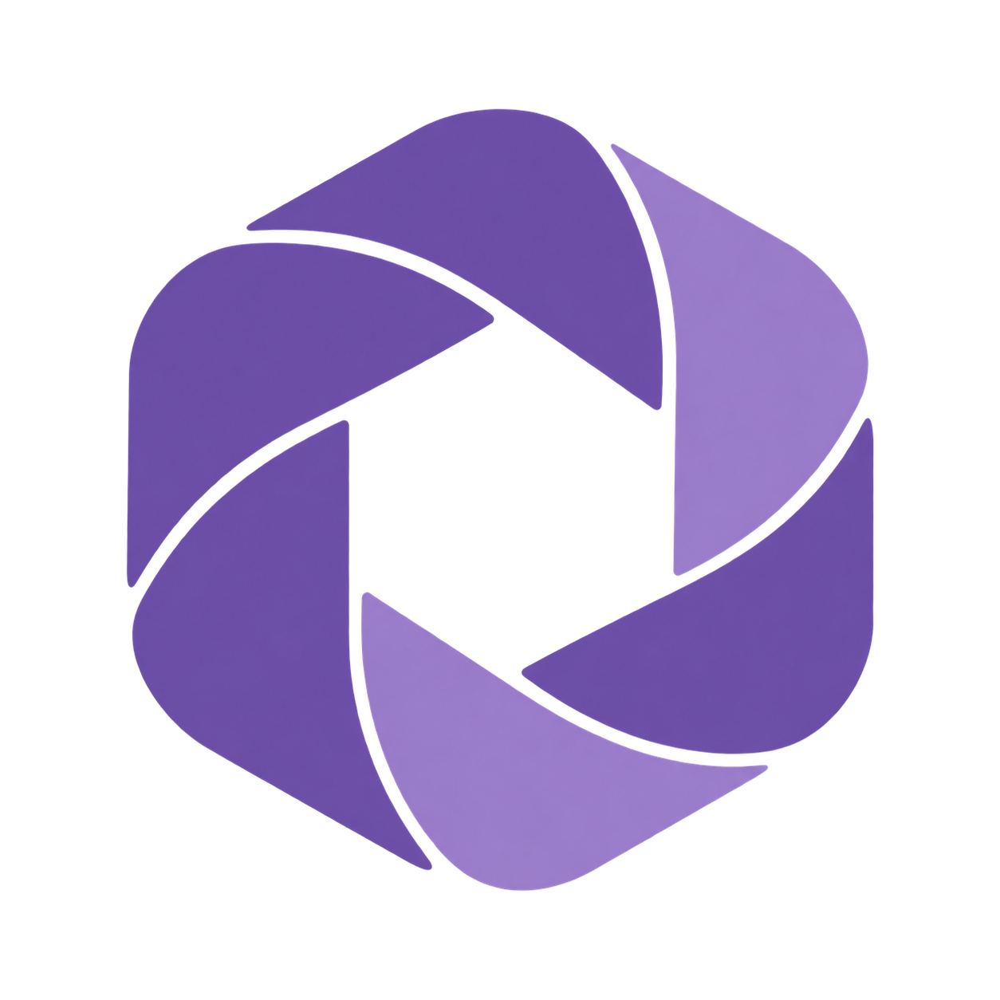
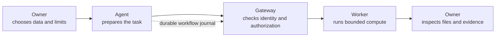

<p align="center">
  
</p>

<h1 align="center">Aperture</h1>

<p align="center">
  <strong>Give agents room to act.<br>Keep authority with the owner.</strong>
  <br><br>
  A control layer for agent compute and delegated spending.
</p>

<p align="center">
  <a href="https://github.com/AliNurym/aperture-ai-gateway/actions/workflows/ci.yml"></a>
  <a href="LICENSE"></a>
</p>

Crypto lets software transact. AI agents let software choose what to do next. Together, they make delegated authority a practical problem: **what may an agent do, how much may it spend, and what can its owner inspect afterward?**

**Aperture makes the compute task the unit of permission.** The owner authorizes a wallet-linked agent to run a defined workload against specific inputs, under a spending ceiling and runtime limit. The gateway checks the signed task terms before dispatch; the worker returns named files and signed execution evidence. A journal on the agent host lets accepted work recover after interruption. Data can move through private file references without being copied into the model's context.

## The control loop



The authorization binds a task to its source, immutable input hashes, parameters, budget, and runtime. The agent connects through the Python SDK or a local MCP server. The journal records accepted work so the host can recover it without blindly submitting duplicates.

## What Aperture does today

| Layer | Current capability |
| --- | --- |
| **Permission** | Wallet-linked agent identity and task-level quotes with explicit spend and runtime ceilings. |
| **Compute** | CPU-based Python jobs, including reviewed CSV batch and merge workflows. |
| **Agent access** | Python SDK and local MCP tools for preparing, running, inspecting, and recovering work. The host supplies its own AI model. |
| **Recovery and results** | Durable workflow journals, named output files, signed receipts, and SHA-256 checks before download. |
| **Settlement** | Optional Solana Devnet payment channels; requires a compatible deployed program and a funded channel. |

The MVP is a React workspace, FastAPI gateway, Python worker and SDK, local MCP server, and an optional Solana settlement path. It is a compute control layer—not an AI model, a general-purpose data analyst, or a proof that remote hardware executed faithfully.

## Evidence from the MVP

In a recorded local run, a five-task workflow processed **17,000 synthetic rows**, recovered after an intentional interruption, and completed without duplicate task admission. All three result files matched a direct Python run byte for byte.

That run used trusted host CPU execution in `OFF_CHAIN` mode. It is evidence of workflow recovery and output consistency—not Docker isolation, a Solana payment, remote-compute correctness, or a performance advantage. See the [reproduction steps and full limits](docs/mvp-evidence.md).

## Try it locally

On Windows, with Python 3.11+ and Node.js with npm:

```powershell
.\start_preview.bat
```

The launcher starts the console, gateway, and reviewed local worker together:

- Console: [http://127.0.0.1:3000](http://127.0.0.1:3000)
- API docs: [http://127.0.0.1:8000/docs](http://127.0.0.1:8000/docs)

Connect a wallet, open **Agent workflows**, choose **Use example data**, then review and approve the task limits. This performs real local CPU computation in `OFF_CHAIN` mode: no Solana payment and no Docker isolation. A temporary development key exists only in browser memory; use a persistent wallet if you need approvals to survive a reload.

> **Presentation preview:** `start_demo.bat` opens an overview simulator with illustrative values. It does not submit a job or execute code. Use `start_preview.bat` for a real local workflow.

## Boundaries that matter

- **Local preview:** runs reviewed code on the host; it has no container security boundary.
- **Configured Docker worker:** applies container and resource limits. The coordinator remains trusted because it controls the Docker socket.
- **Devnet settlement:** needs a compatible deployed program, verified configuration, and a funded payment channel. The local preview does not deploy, fund, or settle anything.
- **Signed evidence:** ties identities, workload details, and file hashes to a receipt. It does not prove that a remote worker faithfully performed the computation.

## Documentation

| Start here | Guide |
| --- | --- |
| Run the product | [Local walkthrough and Devnet runbook](docs/demo-runbook.md) |
| Build workflows | [Agent jobs, approvals, and recovery](docs/agent-workflows.md) |
| Connect an agent | [Python SDK](docs/python-agent-sdk.md) · [MCP host](docs/mcp-agent.md) |
| Understand settlement | [Solana protocol](docs/protocol-v2.md) |
| Check the claims | [MVP evidence and limits](docs/mvp-evidence.md) · [Pilot checklist](docs/pilot-checklist.md) |
| Product direction | [Architecture whitepaper](docs/WHITEPAPER.md) · [Two-minute pitch](docs/pitch-en/Aperture-Pitch-Script-EN-v5.md) · [Interactive deck](docs/presentation.html) |

## Development

The [CI workflow](.github/workflows/ci.yml) covers backend, SDK, frontend, and local-validator checks. Run the frontend lint, build, and data tests locally:

```powershell
cd frontend
npm run lint
npm run build
npm run test:data
```

## License

[MIT](LICENSE)
