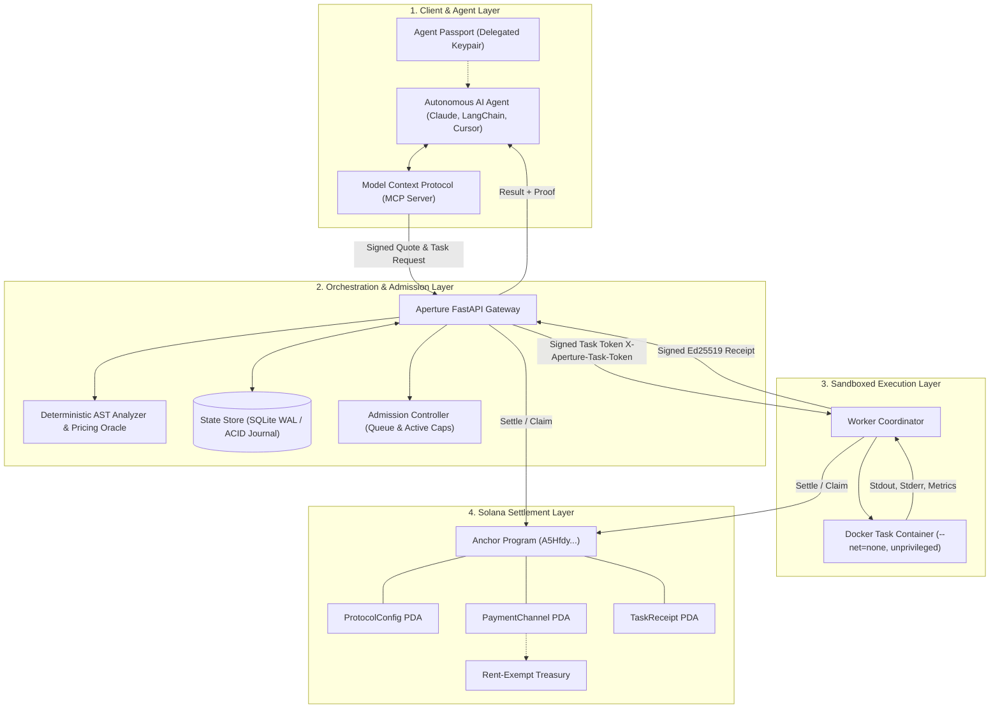
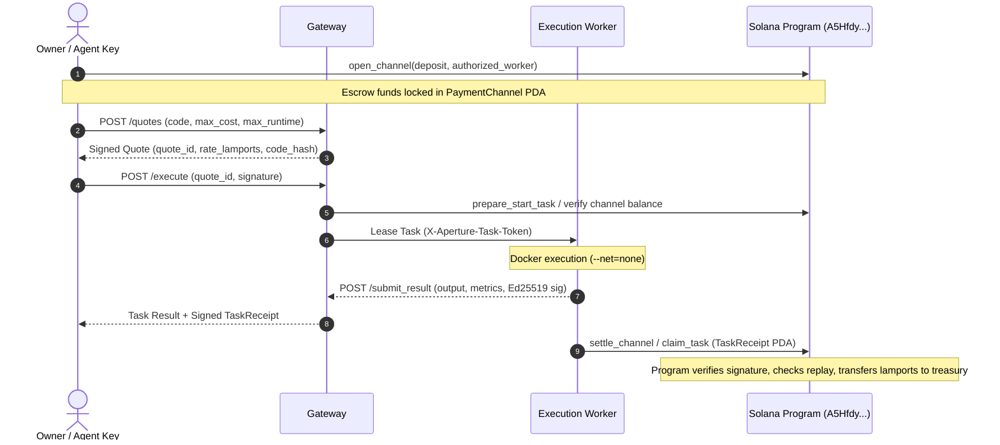

# APERTURE: Verifiable Bounded Compute & Settlement Protocol for Autonomous AI Agents

**Version:** 2.1 (Devnet Architecture Specification)  
**Authors:** Aperture Protocol Core Contributors  
**Classification:** Technical Whitepaper & Cryptographic Specification  
**Solana Program ID:** `A5HfdyRWy77i5DxhTMBa1ZinxVGZbVZnb35EvXUvkNzQ`

---

## 1. Abstract

As artificial intelligence transitions from conversational assistants to goal-directed autonomous agents, a fundamental infrastructure bottleneck emerges: **The Compute Sovereignty Dilemma**. Large Language Models (LLMs) are probabilistic token generators that lack deterministic execution capabilities. When tasked with real-world problems—such as financial modeling, algorithmic verification, data processing, and smart contract orchestration—agents require deterministic, sandboxed execution cycles.

Existing Web2 compute clouds (AWS, GCP, Modal) require centralized human identities, credit card billing, and API tokens that expose host systems to catastrophic risk when delegated to autonomous agents. Conversely, decentralized compute networks (Akash, Render) are architected for long-running batch containers or multi-hour model training, lacking sub-second micro-escrow, source-bound policy enforcement, and cryptographic delegation.

**APERTURE** introduces an off-chain bounded compute oracle coupled with an on-chain Solana micro-settlement substrate. Through **Agent Passports**, human principals delegate bounded cryptographic identities to software agents with revocable, per-run, and total spending allowances. Workloads undergo **deterministic Abstract Syntax Tree (AST) policy analysis** that bounds resource consumption before compute initiation. Micro-billing occurs via **Solana Payment Channels** that charge only upon authenticated worker task admission and conclude with cryptographically signed execution receipts.

---

## 2. The Core Problem: The Compute Sovereignty Dilemma

```
┌────────────────────────────────────────────────────────────────────────┐
│                        THE COMPUTE DILEMMA                             │
├──────────────────────────────────┬─────────────────────────────────────┤
│      UNBOUNDED LOCAL COMPUTE     │        CENTRALIZED CLOUD COMPUTE    │
├──────────────────────────────────┼─────────────────────────────────────┤
│ ❌ Shell injection & key theft   │ ❌ Requires human KYC & credit card │
│ ❌ Host crash via fork bombs     │ ❌ High latency & cold-start costs  │
│ ❌ No verifiable resource bounds │ ❌ Catastrophic liability on prompt │
│ ❌ Lack of agent micro-billing   │    injection or runaway agent loops │
└──────────────────────────────────┴─────────────────────────────────────┘
                                   │
                                   ▼
┌────────────────────────────────────────────────────────────────────────┐
│                    APERTURE: BOUNDED & VERIFIABLE                      │
├────────────────────────────────────────────────────────────────────────┤
│ ✔ Cryptographic Agent Passports with spending caps                     │
│ ✔ Deterministic AST static pre-check (pre-flight quote)                │
│ ✔ Hardened Docker sandboxes (--net=none, unprivileged, cgroups)        │
│ ✔ Real-time sub-second payment-channel escrow on Solana               │
│ ✔ Verifiable Ed25519 Task Receipts for on-chain settlement            │
└────────────────────────────────────────────────────────────────────────┘
```

When an autonomous AI agent needs to evaluate an algorithm:
1. **Unbounded Local Execution is Unacceptable:** Executing agent-generated code on the user's host or server allows malicious prompts (Indirect Prompt Injection) to exfiltrate private keys, delete files, or compromise system daemons.
2. **Web2 Cloud Billing is Incompatible with Autonomy:** AI agents cannot legally possess credit cards or sign corporate contracts. Funding an agent with master cloud credentials allows rogue loops to consume thousands of dollars in minutes.
3. **Deterministic Economic Predictability is Mandatory:** Agents must know the exact worst-case cost in lamports *before* committing capital.

---

## 3. Protocol Architecture & System Layers

Aperture functions across five decoupled, fault-tolerant layers:



### 3.1 Layer 1: Cryptographic Delegation (Agent Passports)
Principals retain master wallet security while delegating autonomous operational keys to their agents. An **Agent Passport** establishes:
* `owner`: Principal's base58 Solana public key.
* `agent_pubkey`: Dedicated agent session public key.
* `max_cost_lamports`: Absolute ceiling on lamports spent per individual task execution.
* `max_runtime_seconds`: Strict execution window (timeout) per job.
* `total_budget_lamports`: Aggregate balance the agent is authorized to consume across its lifetime.
* `expires_at`: Epoch timestamp past which the passport is cryptographically invalid.
* `capabilities`: Permitted primitives (e.g., `["python.execute"]`).

The gateway checks allowance reservations in real time against the on-chain passport account or durable ledger, rejecting tasks before admission if allowances are exhausted.

### 3.2 Layer 2: Deterministic AST Policy & Dynamic Pricing Oracle
Before any container is provisioned or container socket contacted, the submitted source code undergoes deterministic AST inspection (`backend/ai_engine.py`):
1. **Size Boundary:** Payload is capped at 32,000 bytes of UTF-8 source.
2. **Syntax Validation:** Non-compiling Python is rejected immediately without quote generation.
3. **Forbidden Builtins & Reflection:** Static filtering blocks `eval`, `exec`, `__import__`, `compile`, `globals`, `locals`, `vars`, `getattr`, `setattr`, `delattr`, `exit`, `quit`, `open`, `system`, and all dunder/private attribute traversals (`_os`, `__subclasses__`).
4. **Curated Workload Allowlist:** Scientific and mathematical libraries (`math`, `random`, `time`, `hashlib`, `statistics`, `decimal`, `fractions`, `json`, `numpy`).
5. **Algorithmic Complexity Scoring:** The AST visitor evaluates loop nesting depth, matrix multiplications, branching, and recursion to formulate a deterministic complexity metric $C$:

$$\text{Complexity Factor} = \max\left(0.2, \frac{\sum \text{Ops}}{30.0}\right)$$

The per-second compute rate $R_{\text{lamports}}$ is computed as:

$$R_{\text{lamports}} = \text{clamp}\left(500, \frac{R_{\text{base}} \times \text{Complexity}}{\text{HW Power}} \times \text{APS}, 25000\right)$$

Where $\text{APS}$ is the **Aperture Penalty Scale** derived from real-time worker load telemetry:

$$\text{APS} = 1.0 + 2.0 \cdot \sigma(\Delta_{\text{telemetry}})$$

### 3.3 Layer 3: Hardened Sandboxed Execution Runtime
Workers (`backend/worker.py`) implement defence-in-depth:
* **Network Isolation:** Docker container launched with `--net=none`. The network stack is physically unallocated in the Linux kernel namespace, making egress impossible.
* **Privilege Demotion:** Code executes under an unprivileged UID (`nobody` / `appuser`).
* **Resource Quotas (Cgroups):**
  * `mem_limit`: 256 MiB to 512 MiB hard limit (OOM killer triggers immediately on memory bombs).
  * `cpu_quota` / `cpu_period`: Bounded CPU allocation preventing host starvation.
  * `pids_limit`: Maximum processes capped to 64, rendering fork bombs ineffective.
* **Read-Only Storage:** Code and inputs are mounted read-only via ephemeral memory mounts (`tmpfs`).
* **Worker Leases:** Tasks are assigned via lease tokens with lease expirations and heartbeats. If a worker goes offline mid-execution, the gateway detects the expired lease and recovers state safely.

### 3.4 Layer 4: Model Context Protocol (MCP) Integration
Aperture provides an Anthropic-compliant **Model Context Protocol (MCP)** server (`sdk/python/aperture_client/mcp_server.py`) exposing standard tools to Claude Desktop, Cursor, and autonomous agents:
* `aperture_get_quote`: Evaluates script complexity and quotes worst-case lamport expenditure.
* `aperture_execute_python`: Dispatches the bounded task and polls for verified results.
* `aperture_get_task_status`: Real-time task inspection.
* `aperture_cancel_task`: Revocation of queued jobs.

**Security Innovation:** The MCP server maintains capability tokens and private key material in an **In-Memory Capability Store**. Sensitive authentication tokens are filtered from LLM context windows, eliminating Prompt Injection leakage vectors.

---

## 4. Solana On-Chain Settlement Mechanics



### 4.1 On-Chain State Accounts
1. **`ProtocolConfig` (`b"config"`):**
   * Pinned `config_authority` verified at build time.
   * Treasury account with rent-exempt balance enforcement.
   * Protocol commission rate ($BPS$).
2. **`PaymentChannel` (`b"channel"`, agent, nonce):**
   * Multi-task escrow avoiding on-chain transaction overhead per invocation.
   * `deposited_amount`, `claimed_amount`, `expiry_slot`.
   * Funds are reclaimable by principal once `current_slot > expiry_slot`.
3. **`TaskReceipt` (`b"receipt"`, task_hash):**
   * Replay prevention PDA storing:
     $$\text{Task Hash} = \text{SHA256}(\text{task\_id} \parallel \text{code\_hash} \parallel \text{rate} \parallel \text{started\_at})$$
   * Verifies worker signature and records billed execution units.

---

## 5. Comparative Analysis: Aperture vs. Industry Alternatives

| Feature / Dimension | **APERTURE** | **AWS Lambda** | **Akash Network** | **Phala Network (TEE)** |
| :--- | :--- | :--- | :--- | :--- |
| **Target Consumer** | Autonomous AI Agents | Enterprise Cloud Devs | Container Ops / Hosting | Confidential Workloads |
| **Identity & Auth** | Solana Keypairs & Passports | AWS IAM & Credit Cards | Keplr / Cosmos Wallet | SGX Enclaves / Certs |
| **Billing Granularity** | Sub-second lamport streaming | 1ms billing to Credit Card | Hourly / Daily Leases | Token Gas Billing |
| **Pre-Flight Pricing** | Deterministic AST Quote | Unpredictable (Post-billing) | Bid/Ask Market | Gas Limit Estimate |
| **Network Isolation** | `--net=none` (Zero Egress) | Configurable VPC | Open Network | Open / Enclave proxy |
| **Agent Protocol Support** | Native MCP + Python SDK | REST / SDK | CLI / Akash Deploy | RPC / Polkadot SDK |
| **Settlement Evidence** | Signed `TaskReceipt` PDA | CloudWatch Logs | On-chain Escrow Close | Remote Attestation Proof |

---

## 6. Threat Model & Security Posture

### 6.1 Attack Vectors & Mitigations
* **Threat 1: Malicious Code Execution (Host Escape)**
  * *Mitigation:* Dual boundary. Layer 1 AST inspector rejects dangerous imports and reflection. Layer 2 executes in unprivileged Docker with zero network, drop-all Linux capabilities, read-only rootfs, and cgroups limits.
* **Threat 2: Exhaustion DoS & Fork Bombs**
  * *Mitigation:* Kernel `pids_limit` prevents thread creation. Hard execution timer forcibly kills containers upon `deadline_unix`. Gateway rejects concurrent requests above `APERTURE_MAX_ACTIVE_TASKS`.
* **Threat 3: Double-Claiming & Financial Replay**
  * *Mitigation:* On-chain `TaskReceipt` PDA initialization fails if `task_hash` exists. State store enforces unique active wallet constraints in SQLite ACID transactions.
* **Threat 4: Worker Result Tampering**
  * *Mitigation:* Ed25519 signature over normalized result tuple $(\text{task\_id}, \text{source\_hash}, \text{duration}, \text{exit\_code}, \text{output\_hash})$.

---

## 7. Roadmap & Future Innovations

1. **Hardware Confidentiality (TEE Enclaves):** Implementation of Intel SGX / AMD SEV execution backends providing hardware-rooted Remote Attestation proofs alongside Solana receipts.
2. **Decentralized Multi-Worker Gossip:** Replacement of the single coordinator with a libp2p mesh of execution nodes executing under consensus or optimistic challenge periods.
3. **SPL-Token Micro-Channels:** Native integration with USDC and AI-native tokens via Token-2022 transfer-hook payment channels.
4. **GPU Acceleration for Small-Tensor Inference:** Adding bounded CUDA runtimes for local model verification and matrix operations.

---

## 8. Conclusion

APERTURE bridges the divide between non-deterministic probabilistic intelligence and deterministic decentralized finance. By providing AI agents with a secure, bounded computational organ governed by cryptographic passports and Solana micro-settlement, APERTURE establishes the fundamental computing substrate for the autonomous agentic economy.
