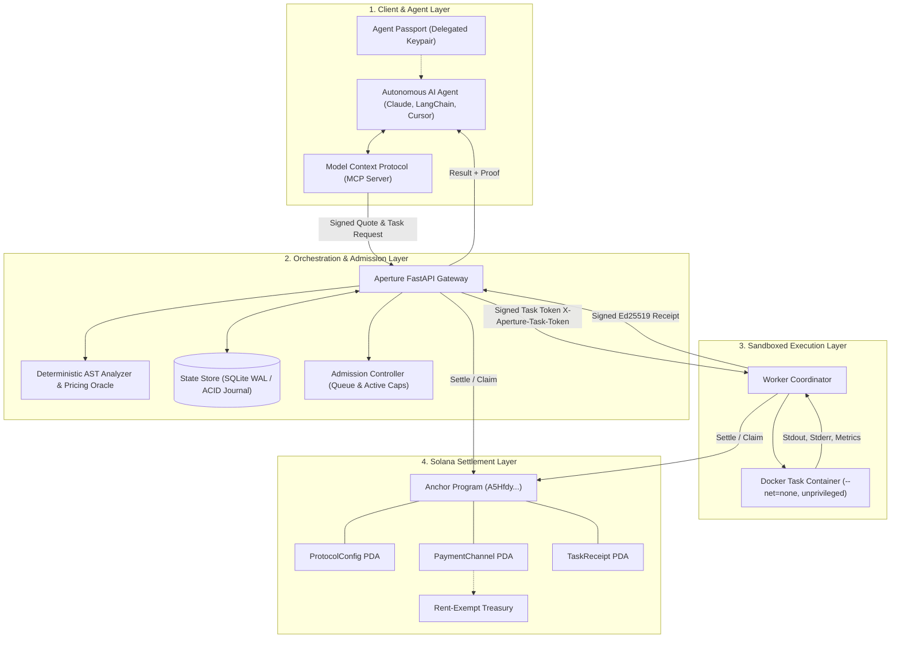
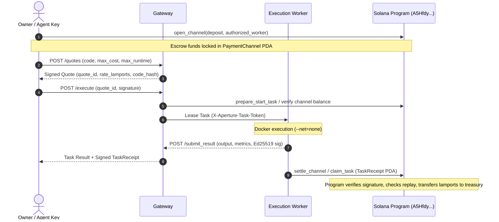

# APERTURE: Verifiable Bounded Compute & Settlement Protocol for Autonomous AI Agents

**Version:** 2.2 (Autonomous Agent & DePIN Grid Architecture Specification)  
**Authors:** Aperture Protocol Core Contributors  
**Classification:** Implementation & Architecture Notes
**Solana Program ID:** `A5HfdyRWy77i5DxhTMBa1ZinxVGZbVZnb35EvXUvkNzQ`

---

> **Implementation scope (2026-10-05):** This paper mixes shipped behavior with architecture targets. The current MVP is a CPU gateway/worker, frontend, Python SDK/MCP server and Solana Devnet settlement protocol. The local preview runs OFF_CHAIN trusted-local Python without container isolation; Docker isolation is available only when configured. Signatures bind reported identities and result hashes, but do not prove faithful computation. Hardware confidentiality, decentralized workers and GPU execution remain roadmap items. See the README and `docs/mvp-evidence.md` for current scope.

## 1. Abstract

As artificial intelligence transitions from conversational assistants to goal-directed autonomous agents, a fundamental infrastructure bottleneck emerges: **The Compute Sovereignty Dilemma**. Large Language Models (LLMs) are probabilistic token generators that lack deterministic execution capabilities. When tasked with real-world problems—such as financial modeling, algorithmic verification, data processing, and smart contract orchestration—agents require deterministic, sandboxed execution cycles.

General-purpose cloud providers offer flexible compute but expect operators to manage credentials, budgets and execution policies. Decentralized providers offer different provisioning and trust models. Aperture focuses on a narrower workflow: owner-issued agent identity, source-policy checks, explicit task/runtime limits, resumable CPU work and signed result metadata.

**APERTURE** combines an off-chain CPU gateway/worker with an optional Solana Devnet settlement protocol. Agent Passports and owner-signed quotes bind agent identity, task spend caps and runtime limits. AST checks reject selected source patterns and inform deterministic quotes; configured worker limits enforce runtime and resource ceilings. Devnet tasks settle through payment channels and persistent TaskReceipt accounts, while OFF_CHAIN tasks have no Solana settlement. Gateway and worker signatures bind the reported result and its hashes but do not prove faithful computation.

---

## 2. The Core Problem: The Compute Sovereignty Dilemma

```
┌────────────────────────────────────────────────────────────────────────┐
│                        THE COMPUTE DILEMMA                             │
├──────────────────────────────────┬─────────────────────────────────────┤
│      UNBOUNDED LOCAL COMPUTE     │        CENTRALIZED CLOUD COMPUTE    │
├──────────────────────────────────┼─────────────────────────────────────┤
│ [-] Shell injection & key theft   │ [-] Broad operator keys & billing │
│ [-] Host crash via fork bombs     │ [-] High latency & cold-start costs  │
│ [-] No verifiable resource bounds │ [-] Catastrophic liability on prompt │
│ [-] Lack of agent micro-billing   │     injection or runaway agent loops │
└──────────────────────────────────┴──────────────────────────────────────┘
                                   │
                                   ▼
┌─────────────────────────────────────────────────────────────────────────┐
│                    APERTURE: BOUNDED & VERIFIABLE                       │
├─────────────────────────────────────────────────────────────────────────┤
│ [+] Cryptographic Agent Passports with spending caps                    │
│ [+] Deterministic AST static pre-check (pre-flight quote)               │
│ [+] Hardened Docker sandboxes (--net=none, unprivileged, cgroups)       │
│ [+] Real-time sub-second payment-channel escrow on Solana              │
│ [+] Verifiable Ed25519 Task Receipts for on-chain settlement           │
└─────────────────────────────────────────────────────────────────────────┘
```

When an autonomous AI agent needs to evaluate an algorithm:
1. **Unbounded Local Execution is Unacceptable:** Executing agent-generated code on the user's host or server allows malicious prompts (Indirect Prompt Injection) to exfiltrate private keys, delete files, or compromise system daemons.
2. **Web2 Cloud Billing is Incompatible with Autonomy:** AI agents cannot legally possess credit cards or sign corporate contracts. Funding an agent with master cloud credentials allows rogue loops to consume thousands of dollars in minutes.
3. **Deterministic Economic Predictability is Mandatory:** Agents must know the exact worst-case cost in lamports *before* committing capital.

---

## 3. Protocol Architecture & System Layers

Aperture functions across five decoupled, fault-tolerant layers:



### 3.1 Layer 1: Cryptographic Delegation (Agent Passports)
Principals retain master wallet security while delegating autonomous operational keys to their agents. An **Agent Passport** establishes:
* `owner`: Principal's base58 Solana public key.
* `agent_pubkey`: Dedicated agent session public key.
* `max_cost_lamports`: Absolute ceiling on lamports spent per individual task execution.
* `max_runtime_seconds`: Strict execution window (timeout) per job.
* `total_budget_lamports`: Aggregate balance the agent is authorized to consume across its lifetime.
* `expires_at`: Epoch timestamp past which the passport is cryptographically invalid.
* `capabilities`: Permitted primitives (e.g., `["python.execute"]`).

The gateway checks allowance reservations in real time against the on-chain passport account or durable ledger, rejecting tasks before admission if allowances are exhausted.

### 3.2 Layer 2: Source Policy & Quote Inputs

AST checks reject selected source patterns and estimate complexity; they do not enforce CPU or memory limits. The configured worker enforces runtime/resource limits. In the current quote path, the heuristic uses the default hardware factor and zero telemetry delta; published workload profiles can instead use the operator-configured tariff.
Before any container is provisioned or container socket contacted, the submitted source code undergoes deterministic AST inspection (`backend/ai_engine.py`):
1. **Size Boundary:** Payload is capped at 32,000 bytes of UTF-8 source.
2. **Syntax Validation:** Non-compiling Python is rejected immediately without quote generation.
3. **Forbidden Builtins & Reflection:** Static filtering blocks `eval`, `exec`, `__import__`, `compile`, `globals`, `locals`, `vars`, `getattr`, `setattr`, `delattr`, `exit`, `quit`, `open`, `system`, and all dunder/private attribute traversals (`_os`, `__subclasses__`).
4. **Curated Workload Allowlist:** Scientific and mathematical libraries (`math`, `random`, `time`, `hashlib`, `statistics`, `decimal`, `fractions`, `json`, `numpy`).
5. **Algorithmic Complexity Scoring:** The AST visitor evaluates loop nesting depth, matrix multiplications, branching, and recursion to formulate a deterministic complexity metric $C$:

$$\text{Complexity Factor} = \max\left(0.2, \frac{\sum \text{Ops}}{30.0}\right)$$

The per-second compute rate $R_{\text{lamports}}$ is computed as:

$$R_{\text{lamports}} = \text{clamp}\left(500, \frac{R_{\text{base}} \times \text{Complexity}}{\text{HW Power}} \times \text{APS}, 25000\right)$$

Where $\text{APS}$ is the **Aperture Penalty Scale** derived from real-time worker load telemetry:

$$\text{APS} = 1.0 + 2.0 \cdot \sigma(\Delta_{\text{telemetry}})$$

### 3.3 Layer 3: Hardened Sandboxed Execution Runtime
Workers (`backend/worker.py`) implement defence-in-depth:
* **Network Isolation (Docker mode):** The task container is launched with networking disabled. The host, container runtime and gateway remain trusted; this does not prove that every host-level route or side channel is absent.
* **Privilege Demotion:** Code executes under an unprivileged UID (`nobody` / `appuser`).
* **Resource Quotas (Cgroups):**
  * `mem_limit`: 256 MiB to 512 MiB hard limit (OOM killer triggers immediately on memory bombs).
  * `cpu_quota` / `cpu_period`: Bounded CPU allocation preventing host starvation.
  * `pids_limit`: Docker caps task creation at the configured limit; this helps bound process exhaustion but does not make hostile code safe by itself.
* **Read-Only Storage:** Code and inputs are mounted read-only via ephemeral memory mounts (`tmpfs`).
* **Worker Leases:** Tasks are assigned via lease tokens with lease expirations and heartbeats. If a worker goes offline mid-execution, the gateway detects the expired lease and recovers state safely.

### 3.4 Layer 4: Model Context Protocol (MCP) Integration
Aperture provides an Anthropic-compliant **Model Context Protocol (MCP)** stdio server (`sdk/python/aperture_client/mcp_server.py`) exposing **19 standardized tools** across 4 capability tiers:

1. **Tier 1: Bounded Python Compute**
   * `quote_python`: Analyzes Python source, validates AST security, and calculates bounded rates.
   * `start_python_task`: Submits a quoted script for containerized execution.
   * `list_python_tasks`: Queries the authenticated agent's recent task history.
   * `resume_python_task`: Reconnects to an in-flight task without duplicate charge.
   * `get_python_task`: Polls task execution progress, stdout, and signed receipts.
   * `cancel_python_task`: Issues an early termination request to free allocated resources.

2. **Tier 2: Private Storage & Artifact Management**
   * `upload_compute_input`: Uploads raw data as immutable objects without exposing bytes to LLM context.
   * `quote_compute_job`: Binds private input hashes, parameters, and reviewed templates into one quote.
   * `start_compute_job`: Dispatches data processing jobs to authenticated workers.
   * `read_compute_artifact`: Retrieves verified output artifacts (`report.json`, `categories.csv`) with hash checks.
   * `get_compute_storage`: Inspects current storage usage against the 256 MiB quota.
   * `release_compute_object`: Purges temporary input files once execution concludes.

3. **Tier 3: DAG Workflows & Data Pipelines**
   * `prepare_compute_workflow`: Pre-validates a multi-step batch/merge DAG and budget envelope.
   * `step_compute_workflow`: Advances the workflow by executing the next ready dependency step.
   * `get_compute_workflow_status`: Provides real-time visibility into overall DAG progress.

4. **Tier 4: Owner Delegation & Workflow Inbox**
   * `get_assigned_workflows`: Checks the agent's inbox for owner-assigned workflow pipelines.
   * `start_assigned_workflow`: Executes owner-authorized DAGs with durable recovery.
   * `get_assigned_workflow_progress`: Inspects live progress and admitted task IDs.
   * `stop_assigned_workflow`: Gracefully terminates an assigned workflow run.

**Credential handling:** The MCP server keeps authorization secrets, bearer tokens and private keypairs in a process-private in-memory capability store rather than ordinary tool descriptions or responses. This reduces direct credential exposure; it does not prevent prompt injection from invoking authorized tools or stop sensitive data from appearing in tool output.

### 3.5 Layer 5: Owner-Scoped Data & Artifact Storage
The current object store scopes files to owner/agent identities, verifies hashes and enforces quotas and release locks. Stored bytes are not encrypted by this object store; access to the host and authorized worker remains a trust boundary.
* **Quota Enforcement:** Each owner/agent pair is constrained to a 256 MiB storage quota and a maximum of 512 concurrent objects (`backend/artifact_store.py`).
* **Content Addressing:** Files are referenced strictly by their SHA-256 hash and unique `obj-<hex>` identifiers.
* **Lease Locking:** Files cannot be deleted while bound to active quotes or in-progress DAG stages.
* **Read-Only Mounting:** In worker containers, data inputs are mounted with read-only permissions (`0o444`), preventing script tampering.

### 3.6 Layer 6: Owner Delegation Workflow Inbox
To eliminate human-in-the-loop bottlenecks during large-scale workflows:
* **One-Time Budget Authorization:** The owner issues a single cryptographic budget ceiling (e.g. 500,000 lamports) for an entire DAG workflow.
* **Autonomous Ingestion:** The agent polls its assigned inbox (`/agents/workflows/assigned`), discovers pending pipelines, and executes individual steps without requesting human signatures per batch.
* **Emergency Halt Sovereign Authority:** The principal retains a non-repudiable emergency kill-switch (`Aperture owner control v1`) allowing instant termination of runaway agent workloads without corrupting finished state.

---

## 4. Solana On-Chain Settlement Mechanics



### 4.1 On-Chain State Accounts
1. **`ProtocolConfig` (`b"config"`):**
   * Pinned `config_authority` verified at build time.
   * Treasury account with rent-exempt balance enforcement.
   * Protocol commission rate ($BPS$).
2. **`PaymentChannel` (`b"channel"`, agent, nonce):**
   * Multi-task escrow avoiding on-chain transaction overhead per invocation.
   * `deposited_amount`, `claimed_amount`, `expiry_slot`.
   * Funds are reclaimable by principal once `current_slot > expiry_slot`.
3. **`TaskReceipt` (`b"receipt"`, task_hash):**
   * Replay prevention PDA storing:
     $$\text{Task Hash} = \text{SHA256}(\text{task\_id} \parallel \text{code\_hash} \parallel \text{rate} \parallel \text{started\_at})$$
   * Verifies worker signature and records billed execution units.

---

## 5. Positioning Hypotheses (Not a Benchmark)

The following matrix is a product-positioning hypothesis, not a current feature-by-feature benchmark or provider audit. Verify each provider claim against current primary documentation before external use.

| Feature / Dimension | **APERTURE** | **AWS Lambda** | **Akash Network** | **Phala Network (TEE)** |
| :--- | :--- | :--- | :--- | :--- |
| **Target Consumer** | Autonomous AI Agents | Enterprise Cloud Devs | Container Ops / Hosting | Confidential Workloads |
| **Identity & Auth** | Solana Keypairs & Passports | AWS IAM & Credit Cards | Keplr / Cosmos Wallet | SGX Enclaves / Certs |
| **Billing Granularity** | Sub-second lamport streaming | 1ms billing to Credit Card | Hourly / Daily Leases | Token Gas Billing |
| **Pre-Flight Pricing** | Deterministic AST Quote | Unpredictable (Post-billing) | Bid/Ask Market | Gas Limit Estimate |
| **Network Isolation** | Disabled networking in configured Docker mode | Configurable VPC | Provider-specific | Enclave / proxy dependent |
| **Agent Protocol Support** | Native MCP + Python SDK | REST / SDK | CLI / Akash Deploy | RPC / Polkadot SDK |
| **Settlement Evidence** | Signed `TaskReceipt` PDA | CloudWatch Logs | On-chain Escrow Close | Remote Attestation Proof |

---

## 6. Threat Model & Security Posture

### 6.1 Attack Vectors & Mitigations
* **Threat 1: Malicious Code Execution (Host Escape)**
  * *Mitigation:* Source-policy checks reject selected unsafe constructs; they are not a sandbox. Configured Docker workers add an unprivileged container, disabled container networking, a read-only root and resource limits. The trusted-local preview has no container boundary.
* **Threat 2: Exhaustion DoS & Fork Bombs**
  * *Mitigation:* Docker `pids_limit` caps task creation, and the container runtime enforces configured memory, CPU and time limits. These controls depend on a correctly configured host and do not protect trusted-local execution. Gateway rejects concurrent requests above `APERTURE_MAX_ACTIVE_TASKS`.
* **Threat 3: Double-Claiming & Financial Replay**
  * *Mitigation:* On-chain `TaskReceipt` PDA initialization fails if `task_hash` exists. State store enforces unique active wallet constraints in SQLite ACID transactions.
* **Threat 4: Worker Result Tampering**
  * *Mitigation:* Ed25519 signature over normalized result tuple $(\text{task\_id}, \text{source\_hash}, \text{duration}, \text{exit\_code}, \text{output\_hash})$.

---

## 7. Roadmap & Future Innovations

1. **Hardware Confidentiality (TEE Enclaves):** Implementation of Intel SGX / AMD SEV execution backends providing hardware-rooted Remote Attestation proofs alongside Solana receipts.
2. **Decentralized Multi-Worker Gossip:** Replacement of the single coordinator with a libp2p mesh of execution nodes executing under consensus or optimistic challenge periods.
3. **SPL-Token Micro-Channels:** Native integration with USDC and AI-native tokens via Token-2022 transfer-hook payment channels.
4. **GPU Acceleration for Small-Tensor Inference:** Adding bounded CUDA runtimes for local model verification and matrix operations.

---

## 8. Conclusion

Aperture is an early CPU compute product for developers who need owner-approved agent workloads, bounded spending, durable recovery and verifiable result files. Its current Solana integration settles tasks on Devnet; it does not prove that a worker computed the result faithfully. The product hypothesis is that this control-and-recovery path is useful enough to repeat. Independent pilots must test that need before making a market claim.
